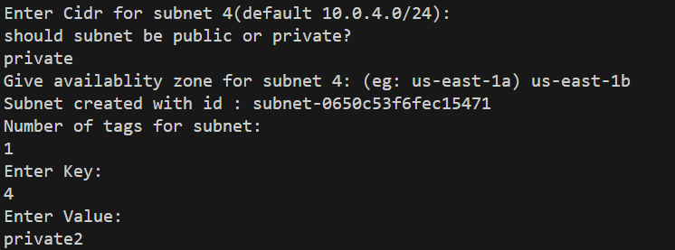

# My AWS Resources

This repository contains scripts and resources for managing AWS services.

## Installation

Instructions for setting up the project.
 1. Clone the repo  

 `git clone https://github.com/your-username/project-name.git`  

2. Navigate to the project folder

`cd my-aws-resources`

3. Ensure you have AWS CLI

`aws configure`

## Usage

1. Executing the script 

`chmod +x vpc.sh`

2. Running the script

`./vpc.sh`

# Output Screenshots  

1. Menu  

2. Creating VPC   

  
 

3. Creating Subnet  

 
  

4. Internet gateway and Route Table  

  

5. Security Group  

